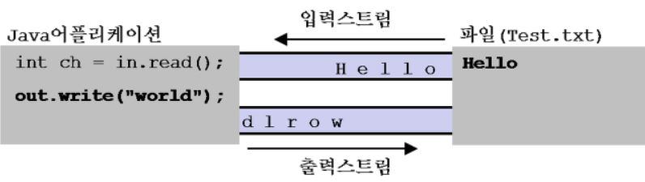

# 입출력(I/O)  

## 입출력  
 - Input과 Output의 약자로, 입력과 출력을 간단히 줄여 입출력이라고 한다.  
 - 입출력은 컴퓨터 내부 또는 외부와 프로그램 간의 데이터 전달을 말한다.  

### 예시  
 - 입력 : 사용자에게 키보드로 데이터를 입력받거나, 파일을 통해 입력받는 것  
 - 출력 : 모니터에 출력하거나, 파일에 내용을 작성하는 것  

    입력과 출력은 스트림을 통해 수행된다.    

### 스트림  
 - 어느 한 쪽에서 다른 쪽으로 데이터를 전달하기 위해 사용되는 두 대상이 연결된 통로 즉, 데이터를 운반하는데 사용되는 연결 통로  

 - 하나의 스트림으로 입력과 출력을 동시에 할 수 없기 때문에, 데이터를 전달하기 위해서는 입력스트림(InputStream)과 출력스트림(OutpurStream) 두 가지가 필요하다.  

### 입출력 스트림  
 

## 입출력의 종류  
 - 바이트 기반 스트림
 - 문자 기반 스트림
 - 보조 스트림
 - 표준 입출력    

## 바이트 기반 스트림  
 - 바이트 단위로 데이터를 전송한다.  

#### 바이트 기반 스트림의 최상위 클래스 : InputStream, OutputStream  
 - 모든 바이트 기반 스트림을 하위 클래스로 둔다.

### InputStream의 종류  
 - FileInputStream
 - ByteArrayInputStream
 - PipedInputStream
 - AudioInputStream

### OutputStream의 종류  
 - FileOutputStream
 - ByteArrayOutputStream
 - PipedOutputStream
 - AudioOutputStream  

### 입출력 대상의 종류  
 FileInputStream - FileOutputStream : 파일이 대상  

 ByteArrayInputStream - ByteArrayOutputStream : 메모리(byte 배열)가 대상  

 PipedInputStream - PipedOutputStream : 프로세스(프로세스 간의 통신)가 대상

 AudioInputStream - AudioOutputStream : 오디오 장치가 대상  

## InputStream과 OutputStream에서 사용하는 메소드  

 기능 : 읽기  
 ### InputStream
  - abstract int read() : 1 바이트 읽기

  - int read(byte[] b) : 바이트 배열 읽기

  - int read(byte[] b, int off, int len) : 시작 위치와 쓸 바이트 개수 지정해서 읽기, off가 시작지점, len이 바이트의 개수    
  
    read()의 반환타입이 byte가 아니라 int인 이유는 read()의 반환값의 범위가 0~255와 -1이기 때문이다.    

 기능 : 쓰기  
### OutputStream
  - abstract void write(int b) : 1 바이트 쓰기  

  - void write(byte[] b) : 바이트 배열 쓰기 

  - void write(byte[] b, int off, int len) : 시작 위치와 쓸 바이트의 개수 지정해서 쓰기, off가 시작지점, len이 바이트의 개수   

  

## 문자 기반 스트림  
- 문자 데이터를 입출력 할 때, 사용하는 기반 스트림  
- 바이트 기반은 입출력 단위가 1byte이기 때문에, 2byte인 문자를 처리하는데 어려움이 있어 그 점을 보완하기 위해 문자 기반의 스트림이 제공된다.  

#### 문자 기반 스트림의 최상위 클래스 : Reader, Writer  
 - 모든 문자 기반 스트림을 하위 클래스로 둔다.  

### Reader의 종류  
 - FileReader
 - CharArrayReader
 - PipedReader
 - StringReader
   
### Writer의 종류  
 - FileWriter
 - CharArrayWriter
 - PipedWriter
 - StringWriter  

### 입출력 대상의 종류  
 FileReader - FileWriter : 파일이 대상  

 CharArrayReader - CharArrayWriter : 메모리(문자 배열)가 대상  

 PipedReader - PipedWriter : 스레드 간 통신이(데이터를 파이프를 통해 전송)가 대상

 StringReader - StringWriter : 문자열 데이터가 대상  

 ## Reader와 Writer에서 사용하는 메소드  
기능 : 읽기  
### Reader  
 - int read() : 문자 1개 읽기 

 - int read(char[] cbuf) : 문자 배열 읽기, 읽은 데이터가 없으면 -1 반환

 - abstract int read(char[] cbuf, int off, int len) : 문자 배열에서 시작 위치와 길이를 지정해서 읽기, off가 시작 위치, len이 길이

기능 : 쓰기  
### Writer  
 - void write(int c) : 문자 1개 쓰기    

 - void write(char[] cbuf) : 문자 배열 쓰기    

 - abstract void write(char[] cbuf, int off, int len) : 문자 배열에서 시작 위치와 길이를 지정해서 쓰기, off가 시작 위치, len이 길이    

 - void write(String str) : 문자열 쓰기    

 - void write(String str, int off, int len) : 문자열의 시작 위치, 길이 지정 후 쓰기, off가 시작 위치, len이 길이  

 ### Reader는 이미 문자로 이루어져 있기 때문에, 문자열 관련 메소드가 필요하지 않다.

 ### 바이트 기반 스트림과 문자 기반 스트림의 비교  
  

 차이점 : 바이트 기반 및 문자 기반이기 때문에 대상이 다르다.  
 
 현재는 StringBufferInputStream, StringBufferOutputStream가 아니라, ByteArrayInputStream, ByteArrayOutputStream를 많이 사용한다.  
  - StringBufferInputStream, StringBufferOutputStream 이전 버전의 자바에서 사용하던 것이기 때문이다.  
  - 바이트 배열의 데이터를 읽고 쓰는데에 사용한다.

### 바이트 기반 스트림과 문자 기반 스트림은 바이트와 문자를 다룬다는 것을 제외하고 사용법에 큰 차이가 없다.  

## 보조 스트림  
스트림의 기능을 보완하기 위해서 제공되는 클래스  
 - 실제 데이터를 주고 받는 스트림이 아니기 때문에 데이터를 입출력 할 수 없다.  

 - 스트림의 기능을 향상시키거나 새로운 기능을 추가할 수 있다.  

 - 보조 스트림은 단독으로 쓰일 수 없기 때문에 기반 스트림과 함께 쓰인다.  

### 보조 스트림의 사용 예시
 <pre>
 <code>
 // 기반 스트림을 먼저 생성
 FileInputStream fis = new FileInputStream("test.txt");  

 // 기반 스트림을 이용해서 보조 스트림 생성
 BufferedInputStream bis = new BufferedInputStream(fis);  

 // 보조 스트림인 BufferedInputStream으로부터 데이터를 읽어온다.  
 bis.read();
 </code>
 </pre>  

### 보조 스트림의 종류  
 

### 바이트 기반 보조 스트림과, 문자 기반 보조 스트림의 변환

 

## 표준 입출력  
표준입출력 : 콘솔(console, 도스창)을 통한 데이터 입력과 콘솔로의 데이터 출력  

### 자바에서 제공하는 표준 입출력 스트림  
 - System.in : 콘솔로부터 데이터를 입력받는데 사용  

 - System.out : 콘솔로 데이터를 출발하는데 사용  

 - System.err : 콘솔로 데이터를 출력하는데 사용  

### 표준입출력 스트림 클래스 타입  
  - System.in : InputStream
  - System.out : PrintStream
  - System.ree : PrintStream  

### 표준입출력의 대상 변경 
   

 입출력을 콘솔 이외의 다른 입출력 대상(파일 등)으로 변경하는 것이 가능하다.

### IOException e, e printStackTrace 사용의 이유  
 - 예외 처리 및 에외의 종류 알림
 - 예외의 이유 : 권한 X, 존재 X 등

 

 

