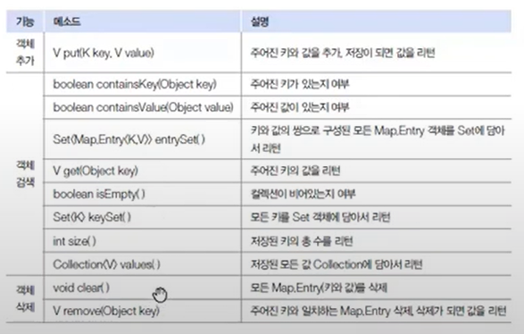

- 컬렉션 프레임워크

배열은 크기를 변경할 수 없고 항목의 저장, 삭제, 추가 메소드가 없다. 컬렉션 프레임 워크는 이와 같은 단점을 보완하는 역할을 한다고 보면된다. 즉, 객체를 효율적으로 추가, 삭제, 검색 할 수 있도록 인터페이스와 구현 클래스를 java.util 패키지에서 제공받는다.

컬렉션은 객체의 저장 + 프레임워크는 사용방법을 정한 라이브러리

즉, 사용 방법을 정의한 인터페이스와 실제 객체를 저장하는 다양한 컬렉션 클래스(구현 클래스)를 제공한다.


list와 set은 콜렉션을 상속 받고 있고 아래 점선과 같이 구현 클래스를 가지고 있다.

- 한눈에 표로 보면


- list 컬렉션


list는 객체를 배열로 관리한다고 보면된다. 저장용량이 자동으로 증가하고 추가, 삭제, 검색을 위한 다양한 메소드들이 제공된다. 객체를 저장한다라고 표현하는거 보단 객체가 번지를 참조한다가 맞는 표현이고 동일한 객체를 중복 저장할 수 있다 왜? 동일한 번지를 참조할 수 있기 때문에~~~.. null 값의 저장도 가능

저장 순서가 유지되는 컬렉션을 구현하는 데 사용
같은 요소의 중복 저장을 허용
배열과 마찬가지로 index로 요소에 접근
리스트와 배열의 가장 큰 차이는 리스트는 자료형 크기가 고정이 아닌 데이터 양에 따라 동적으로 늘어났다 줄어들수 있다는 점이다. (가변)
요소 사이에 빈공간을 허용하지 않아 삽입/삭제 할때마다 배열 이동이 일어난다

- arraylist
    
    

    

인덱스로 객체를 찾거나 마지막에 객체를 추가하는 경우에는 성능이 좋다

배열을 이용하여 만든 리스트
데이터의 저장순서가 유지되고 중복을 허용
데이터량에 따라 공간(capacity)가 자동으로 늘어나거나 줄어들음
단방향 포인터 구조로 자료에 대한 순차적인 접근에 강점이 있어 조회가 빠르다
하지만, 삽입 / 삭제가 느리다는 단점이 있다. 단, 순차적으로 추가/삭제 하는 경우에는 가장 빠르다

빈번한 변경이 있을때는 링크드리스트를 사용하는게 좋다

vector도 똑같은 방법으로 쓰이는데 다른 점은 동기화된 메소드로 구성되어 있다는 점이다 즉, 동시에 메소드를 실행 할 수 없고 하나의 스레드가 메소드 실행 완료하여야 다른 스레드가 메소드를 실행할 수 있기 때문에 안전하게 객체를 추가 삭제 한다 이것을 스레드에 안전하다고 표현 옛날꺼라 굳이…안쓰는듯

```java
public static void main(String[] args) {
    List<String> list = new ArrayList();
    list.add("Java");
    list.add("JDBC");
    list.add("Servlet/JSP");
    list.add(2, "Database");
    list.add("iBATIS");
    int size = list.size();
    System.out.println("총 객체수: " + size);
    System.out.println();
    String skill = (String)list.get(2);
    System.out.println("2: " + skill);
    System.out.println();

    int i;
    String str;
    for(i = 0; i < list.size(); ++i) {
      str = (String)list.get(i);
      System.out.println(i + ":" + str);
    }

    System.out.println();
    list.remove(2);
    list.remove(2);
    list.remove("iBATIS");

    for(i = 0; i < list.size(); ++i) {
      str = (String)list.get(i);
      System.out.println(i + ":" + str);
    }

  }
```

- linkedlist


사용방법은 list의 구현 클래스라 똑같다 하지만 차이점이 있다는 거

노드(객체)를 연결하여 리스트 처럼 만든 컬렉션 (배열이 아님)
데이터의 중간 삽입, 삭제가 빈번할 경우 빠른 성능을 보장한다.
하지만 임의의 요소에 대한 접근 성능은 좋지 않다.

어레이리스트는 내부 배열에 객체를 저장하지만 링크드리스트는 인접 참조를 링크하여 체인처럼 관리 (나는 점 조직이라고 정의함)


수정이나 삭제를 할 경우 모든 객체를 움직이는게 아니라 앞과 뒤만 변경하여 삽입과 제거를 한다. 그래서 빈번한 수정이 있는 경우 링크드리스트가 낫다는 것!! 마지막 추가 삭제의 경우는 어레이리스트가 빠르지만 중간지점에 객체를 삽입하는데 걸리는 시간은 링크드 리스트가 훨씬 더 적게 걸림 (하지만 컴터 성능이 좋아져서 의미가 있나 싶음)

- set컬렉션


데이터의 중복을 허용하지 않고 순서를 유지하지 않는 데이터의 집합 리스트
순서 자체가 없으므로 인덱스로 객체를 검색해서 가져오는 get(index) 메서드도 존재하지 않는다
중복 저장이 불가능하기 때문에 심지어 null값도 하나만 저장할 수 있다


인덱스로 객체를 관리하는게 아니라 인덱스 메소드가 없다


인덱스가 없기 때문에 가져올 때는 이터레이터(반복자) iterator를 사용한다

hasnext 메소드를 이용하여 객체가 있는지 확인하고 있으면 true를 반환하여 next로 하나의 객체를 꺼내어 쓰는 방식

- hashset

객체들의 순서 없이 저장하고 동일한 객체는 중복 저장 하지 않는다.중복 판단은 동일한 해시코드가 있다면 그것을 equals 메소드로 객체를 비교하여 true가 나오면 저장을 안함

```java
public static void main(String[] args) {
    Set<String> set = new HashSet();
    set.add("Java");
    set.add("JDBC");
    set.add("Servlet/JSP");
    set.add("Java");
    set.add("iBATIS");
    int size = set.size();
    System.out.println("총 객체수: " + size);
    Iterator<String> iterator = set.iterator();

    String element;
    while(iterator.hasNext()) {
      element = (String)iterator.next();
      System.out.println("\t" + element);
    }

    set.remove("JDBC");
    set.remove("iBATIS");
    System.out.println("총 객체수: " + set.size());
    Iterator var5 = set.iterator();

    while(var5.hasNext()) {
      element = (String)var5.next();
      System.out.println("\t" + element);
    }

    set.clear();
    if (set.isEmpty()) {
      System.out.println("비어 있음");
    }

  }
```

- map컬렉션
    
    
    

키와 값으로 구성된 map.entry 객체를 저장하는 구조(엔트리는 중첩 인터페이스)


키와 값 모두 객체이고 키는 중복이 안된다 하지만 값은 중복이 된다 만약 동일한 키로 저장된다면 기존 키값은 없어지고 새롭게 저장된 키값으로 저장된다



키로 객체를 관리하기 떄문에 키에 관한 메서드가 많이 있다.

```java
public static void main(String[] args) {
//맵 컬렉션 생성
    Map<String, Integer> map = new HashMap();
//객체 저장
    map.put("신용권", 85);
    map.put("홍길동", 90);
    map.put("동장군", 80);
    map.put("홍길동", 95);
    System.out.println("총 Entry 수: " + map.size());
//객체 찾기
    System.out.println("\t홍길동 : " + map.get("홍길동"));
    System.out.println();
//객체 하나씩 처리
    Set<String> keySet = map.keySet();//keyset얻기
    Iterator<String> keyIterator = keySet.iterator();

    while(keyIterator.hasNext()) {//키값을 얻고 값을 map에서 얻어냄
      String key = (String)keyIterator.next();
      Integer value = (Integer)map.get(key);
      System.out.println("\t" + key + " : " + value);
    }

    System.out.println();
//객체 삭제
    map.remove("홍길동");
    System.out.println("총 Entry 수: " + map.size());
//객체 하나씩 처리
    Set<Map.Entry<String, Integer>> entrySet = map.entrySet();
    Iterator<Map.Entry<String, Integer>> entryIterator = entrySet.iterator();

    while(entryIterator.hasNext()) {//반복해서 map.entry를 얻고 키와 값을 얻어냄
      Map.Entry<String, Integer> entry = (Map.Entry)entryIterator.next();
      String key = (String)entry.getKey();
      Integer value = (Integer)entry.getValue();
      System.out.println("\t" + key + " : " + value);
    }

    System.out.println();
//전체삭제
    map.clear();
    System.out.println("총 Entry 수: " + map.size());
  }

결과값
총 엔트리 3
홍길동 95

홍길동 95
신용권 85
동장군 80

총 엔트리 2
신용권 85
동장군 80

총 엔트리 0
```

해쉬 테이블도 동기화된 메소드로 하나의 스레드가 실행 완료해야 다음 스레드가 실행된다 아까와 동일하게 스레드에 안전합니다 라고 한다. 사용 방법은 해쉬맵과 동일