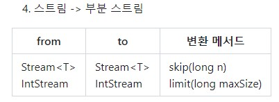

# 스트림 #

## 스트림 ##
 - 데이터 소스가 무엇이든 간에 같은 방식으로 다룰 수 있게 데이터를 추상화  
 - 데이터를 다루는데 자주 사용되는 메소드를 정의해 놓은 것  
 - 배열 혹은 컬렉션 뿐 아니라 파일에 저장된 데이터도 같은 방식으로 다룬다.  

 ### 스트림의 특징 ###
스트림은 데이터 소스를 변경하지 않는다.  
 - 스트림은 데이터 소스로부터 데이터를 읽기만 할 뿐, 데이터 소스를 변경하지 않는다.  

스트림은 일회용이다.  
 - 스트림은 한번 사용하면 닫혀서 다시 사용할 수 없다.  
 - 따라서 다시 사용하려면 스트림을 다시 생성해야 한다.  

<pre>
<code>
- 스트림의 각 요소를 정렬 후 출력
strStream1.sorted().forEach(x -> System.out.println(x));

- 스트림의 요소 개수를 세려는 시도
- sorted()와 foreach()로 이미 스트림이 소모되어 에러 발생
- IllegalStateException 예외 : 객체의 상태가 메소드 호출에 부적절한 경우
int numOfStr = strStream1.count(); 
</code>
</pre>  

스트림은 작업을 내부 반복으로 처리한다.  
 - 내부 반복은 반복문을 메소드 내부에 숨길 수 있다는 것을 의미한다.  
 - 반복을 사용자가 명시적으로 제어하지 않고, 스트림 라이브러리가 내부에서 데이터 반복 처리  
 - 사용자는 각 요소에 대한 연산을 지정, 라이브러리가 내부에서 요소에 대해 반복 처리
<pre>
<code>
- 제네릭 타입 T를 가진 요소에 대한 forEach 메소드 정의
- Consumer를 사용하여 각 요소에 대한 작업 수행
void forEach(Consumer<? super T> action) {
	
    - 매개변수의 null 체크
    Objects.requireNonNull(action);
	
    - 제네릭 타입 T를 가진 요소들을 반복하면서 accept 호출
    - 외부에서 직접 제어하는 것이 아닌 Consumer를 통해 위임
	for(T t : src) {
		action.accept(T);
	}
}
</code>
</pre>  

### 스트림의 연산
 중간 연산  
 - 연산 결과가 스트림인 연산, 스트림에 연속해서 중간 연산할 수 있다.
 - filter, map, distinct 등  

 최종 연산  
 - 연산 결과가 스트림이 아닌 연산, 스트림의 요소를 소모하므로 단 한번만 가능  
 - forEach, count, reduce, collect 등    

 <pre>
 <code>
stream.distinct().limit(5).sorted().forEach(x -> System.out.println(x));

- 중간연산      
distinct() : 중복 제거  
limit(5) : 개수 제한   
sorted() : 정렬    

- 최종연산
forEach : 주어진 작업을 각 요소에 정의

- 지연된 연산  
스트림은 최종 연산이 수행되기 전까지 중간 연산이 수행되지 않는다.  
중간 연산을 호출하는 것은 단순히 어떤 작업이 수행되어야 하는 지 지정하는 것  
최종 연산이 수행되어야 스트림의 요소들이 중간 연산을 거쳐 최종 연산에서 소모된다.
 </code>
 </pre>

### 스트림의 중간 연산 ###  

  

### 스트림의 최종 연산 ###  

### 스트림의 변환 ###  

- 스트림 -> 기본형 스트림  

- 기본형 스트림 -> 스트림  

- 기본형 스트림 -> 기본형 스트림
  

- 스트림 -> 부분 스트림  

- 두 개의 스트림 -> 스트림  

- 스트림의 스트림 -> 스트림  

- 스트림 -> 병렬 스트림  

- 스트림 -> 컬렉션  

- 컬렉션 -> 스트림  

- 스트림 -> Map  

- 스트림 -> 배열  

